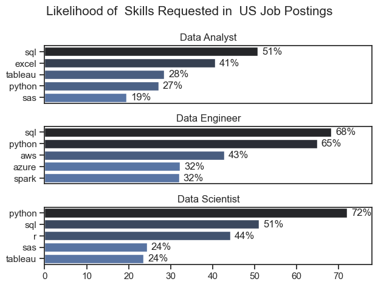
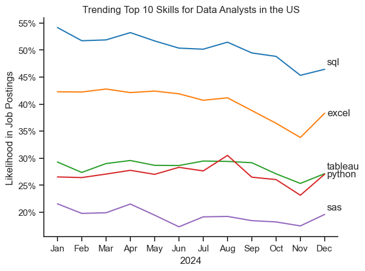
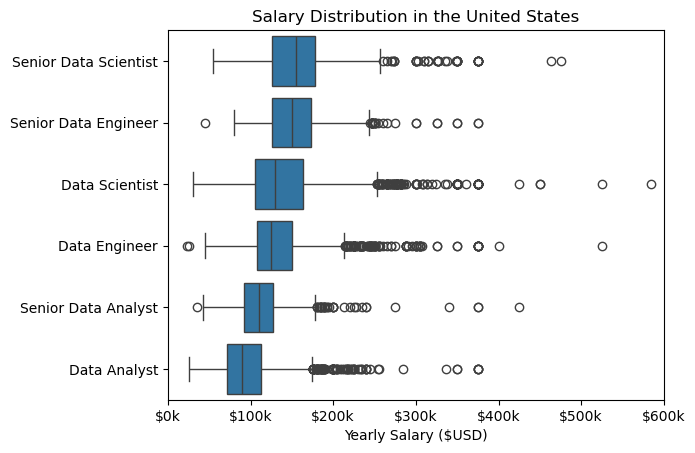
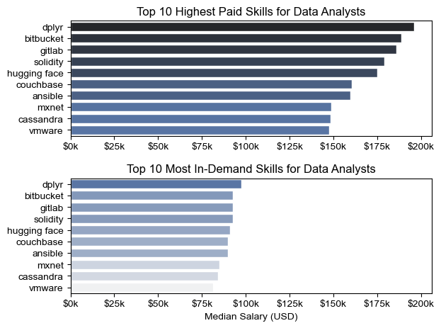

# Data Skills Analysis Project: Insights and Findings

## Project Overview
An in-depth analysis of skill demands across top data roles in the United States, focusing on Data Scientist, Data Analyst, and Data Engineer positions.

## Methodology
- Dataset: Luke Barousse's Data Jobs Dataset
- Scope: US Job Postings
- Analysis: Skill count and percentage across job roles

## 1. What are the most Demanded Skills for the Top 3 most popular Data roles?
View my notebook with detailed steps here:
[2_Skill_Demand.ipynb](2_Skills_Count.ipynb)
### Skill Landscape Across Data Roles


**Notable Observations:**
- Python dominates Data Scientist job market
- 72% of Data Scientist job postings require Python
- R remains a strong language for statistical analysis
- SQL is critical for data manipulation

**Key Findings:**
- SQL is the most crucial skill for Data Analysts
- Excel remains fundamental in data analysis
- Approximately 50.8% of job postings require SQL
- 40.6% of roles demand Excel proficiency


### Skill Demand Patterns

#### Cross-Role Skill Overlap
1. **Python**: Universal across all data roles
2. **SQL**: Essential for data manipulation
3. **Visualization Tools**: Growing importance (Tableau, PowerBI)

### Career Development Recommendations

#### For Aspiring Data Professionals
1. **Prioritize Core Skills**
   - Master Python programming
   - Develop strong SQL skills
   - Learn data visualization tools

2. **Build Versatile Skill Set**
   - Understand tools across different data roles
   - Stay updated with emerging technologies
   - Practice interdisciplinary skill development

3. **Specialized Knowledge**
   - Data Scientists: Focus on Python, R, machine learning
   - Data Analysts: Excel in SQL, Excel, Tableau
   - Data Engineers: Learn cloud platforms, big data technologies


## 2. How are In-Demand Skills trending for Data Analysts ?

### Visualise Data:

```python
df_plot = df_DA_US_percent.iloc[:,:5]
sns.set_theme(style='ticks')
sns.lineplot(data= df_plot,dashes=False,palette='tab10')

plt.title('Trending Top 10 Skills for Data Analysts in the US')
plt.ylabel('Likelihood in Job Postings')
plt.xlabel('2024')
plt.legend().remove()
sns.despine()

ax = plt.gca()

from matplotlib.ticker  import PercentFormatter
ax.yaxis.set_major_formatter(PercentFormatter(decimals=0))


for index in range(5):
    offset = 0.8 if index % 2 == 0 else -0.5
    plt.text(11.1,df_plot.iloc[-1,index] + offset,df_plot.columns[index])

plt.show()

```

### Results



### Insights

- SQL remains the cornerstone skill for data analysts, consistently leading job posting demands, emphasizing its critical role in data-related tasks.
- Excel shows resilience as a vital tool, with steady demand and a year-end surge, highlighting its continued relevance in the industry.
- Visualization tools like Tableau and programming languages like Python maintain steady demand, showcasing their importance for modern data workflows.
- SAS shows niche but growing relevance, suggesting it remains valuable in specific industries.
- The trends suggest SQL and Excel should be primary focus areas for aspiring analysts, followed by skills like Python and Tableau for versatility.
- Seasonal variations in demand underscore the importance of staying updated with market trends and diversifying skills to meet industry needs.

## 4. Salary Analysis for Data Roles

### 4.1 Salary Distribution


#### Visualize Data

```python
sns.boxplot(
    data=df_US_top6,
    x='salary_year_avg',
    y='job_title_short',
    order=job_order
)


plt.title('Salary Distribution in the United States')
plt.xlabel('Yearly Salary ($USD)')
plt.ylabel('')
ax = plt.gca()

ax.xaxis.set_major_formatter(plt.FuncFormatter(lambda sal,_: f'${int(sal/1000)}k'))

plt.xlim(0,600000)

plt.show()
```
### Results


### Insights
- 

### 4.2 Highest Paid and Most In-Demand Skills for Data Analyst

#### visualise data



## Acknowledgments
- Dataset Source: Luke Barousse
- Platform: Hugging Face Datasets


